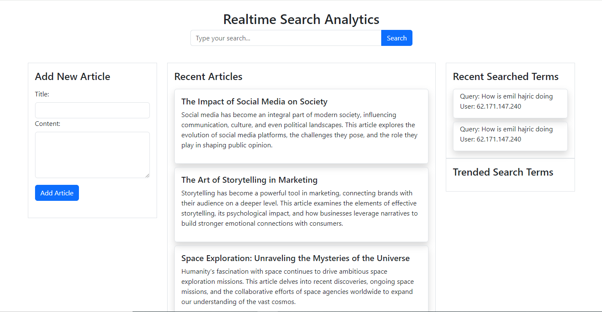

## 📖 Search-Analytics-Frontend
**Search-Analytics:** real-time search analytics with Rails backend and Vanilla JS frontend for instant user search tracking and trend analysis.

| Project View Page                                                                                                       |
| ----------------------------------------------------------------------------------------------------------------------- |
| 

 |

### 🔗 Backend Link 
  > _To access the backend code, please click [here](https://github.com/ab-noori/Search-Analytics-Backend)._

### 🛠 Built With 

  <ul>
    <li>Rails</li>
    <li>PostgreSQL</li>
  </ul>
